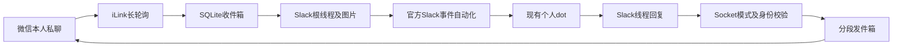

# 架构与投递策略

## 精确映射

每条微信消息以账号、发送者、uint64 消息编号的 SHA-256 为持久主键，保存原始 `context_token`、Slack 根 `root` 与触发源 `source_ts`。消息编号用无损 JSON 解析，绝不先转换为不安全的浮点数。状态目录固定绑定登录账号和扫码本人，换账号必须使用新目录。

新微信消息建立新根线程；图片消息先建立“准备中”根消息，再上传真实文件，最后在原线程发送“【微信消息就绪】”。自动化仅处理桥作者的就绪消息，避免在图片上传完成前回答。文字消息直接以就绪标记发根消息。图片失败时不会假装就绪。

回复必须带精确 `thread_ts`。不认识的线程事件暂存，直到映射出现或 TTL 到期。根消息上的回复、其他频道、其他团队、其他应用和机器人、桥自身以及群聊/陌生人均拒绝。官方应用身份必须同时匹配 user、bot、app 三项，不用“过滤所有 bot”方式误杀合法回复。合法 `file_share` 消息允许进入。

跨轮上下文由 dot 自身记忆及它获授权阅读的 Slack 历史决定；桥不把不同微信消息塞进同一线程，也不把旧回复移交给新上下文。没有可用 context 时失败关闭，等新微信消息建立新映射，旧任务不自动转投。

## 回复完成约定

文字仅接收以 `【最终回复】` 开头的最终正文；“收到”“处理中”等不带标记的回复不转发。默认 5 秒静默窗口合并 `message_changed`，用精确 Slack 时间戳拒绝过时编辑。静默窗口本身不能证明流式完成，dot 必须在真正结束后才加标记。每根线程只送一段最终文字，后续文字修订不再转发。

最终文字与图片可在同一 Slack 消息，也可分开发送。无正文的图片消息允许进入，带正文的图片消息同样要求最终标记；每根线程最多转发 10 个唯一文件 ID，重复事件、编辑附带的同一文件不会再次发送。非图片文件占一个文件名额并回复中文说明。删除事件不回撤已发送内容；根线程外的回复不猜测归属。

## 恢复和失败

SQLite 开启 WAL、FULL 同步和事务。收件箱、分段任务和游标在同一事务提交；Socket 消息先持久化再 ACK。一个状态目录只允许一个进程，使用自动更新的目录锁防止双消费者。

每个出站段独立 `pending → sending → done`。申请 Slack 上传地址和上传原始字节属于准备阶段，失败可安全重试；只有 `files.completeUploadExternal` 前才标记发送中，准备重试可能留下尚未发布的临时文件，由 Slack 清理；429 按 Retry-After 延后。只有明确未发送的限流可以自动重试。发送时网络中断、5xx 或崩溃变成 `uncertain`，不假定远端有幂等保障，不盲重试。稳定 `client_id` 便于对账，但不宣称微信保证幂等。

微信拒绝请求或 session 过期会停止对应上下文出站；轮询 session 过期退避一小时，其他同步错误指数退避至一分钟。准备重试间隔至少 30 秒。文字已成功而图片失败，只保留图片段待处理。

启动先清理到期状态；每次领取任务以及媒体准备后再次检查任务与来源消息的 TTL，过期时不发送，即使 context 尚有效。TTL 默认一天，到期清除正文、URL、上下文及事件负载，保留哈希去重墓碑和投递状态，防重放。原始媒体仅短暂驻留内存，不写媒体缓存；单文件默认 10 MiB，同时串行处理一个媒体任务。数据库默认 100 MiB 容量阈值，达到后拒绝接收并等待维护；阈值按分配页计算，单批事务可有有限超出，部署时还应配置磁盘配额。墓碑不自动清空，直接删除状态会失去重放保护。
